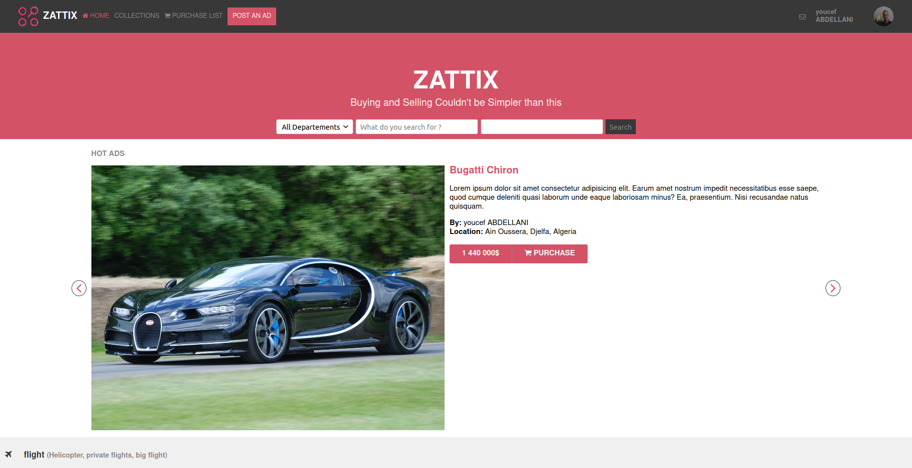
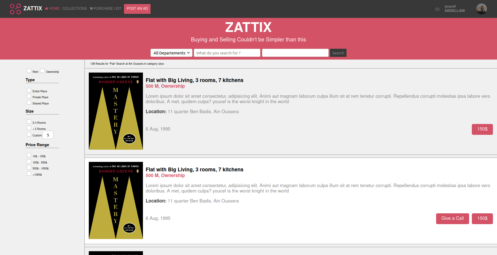

# Zattix-clone

> The objective of this project was to build a web page which is like [ZATTIX](https://www.behance.net/gallery/24796463/ZATTIX)

main page screenshot

Search result page screenshot

The project was the capstone on the microverse HTML/CSS curriculum created using CSS positioning, FLEX for some elements.

## Built With

- HTML, CSS.
- No frameworks,
- Flex
- Box model

## Live Demo

[Live Demo Link](https://raw.githack.com/ABDELLANI-Youcef/zattix-clone/feature-branch/index.html)

[Result page Demo Link](https://raw.githack.com/ABDELLANI-Youcef/zattix-clone/feature-branch/search.html)

## Authors

👤 **Youcef ABDELLANI**

- Github: [@ABDELLANI-Youcef](https://github.com/ABDELLANI-Youcef)
- Twitter: [@YoucefAbdellani](https://twitter.com/YoucefAbdellani)
- Linkedin: [linkedin](https://www.linkedin.com/in/youcef-abdellani-b79361124/)

## 🤝 Contributing

Contributions, issues and feature requests are welcome!

Feel free to check the [issues page](https://github.com/ABDELLANI-Youcef/zattix-clone/issues).

## Show your support

Give a ⭐️ if you like this project!

## Acknowledgments

- CSS Tricks page
- W3 Schools

## 📝 License

This project is [MIT](lic.url) licensed.